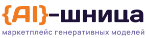

# Логотип {AI}-шница

Значок — яичница-яишенка (белок + желток с глазками), название «{AI}-шница», подпись «маркетплейс генеративных моделей» (выровнена по ширине названия).
Всё в векторе: текст в SVG переведён в кривые, шрифты ставить не нужно.

## Файлы
- `svg/lockup-light.svg` / `svg/lockup-dark.svg` — шапка сайта: «{AI}-шница» + подпись, без значка
- `svg/logo-light.svg` / `svg/logo-dark.svg` — полный горизонтальный логотип (значок + название + подпись)
- `svg/logo-stacked-light.svg` / `-dark.svg` — вертикальный (значок сверху): аватарки, обложки, заставка
- `svg/icon-light.svg` / `-dark.svg` — только значок
- `svg/wordmark-light.svg` / `-dark.svg` — только надпись «{AI}-шница»
- `png/` — PNG с прозрачным фоном: логотипы в 4×, значок 512 / 192 / 32 px, apple-touch-icon 180 px
- `favicon.svg`, `favicon.ico` — иконка во вкладке браузера
- `preview.png` — как выглядит на светлом и тёмном фоне

## Цвета
- {AI} — #F07A1F
- «-шница» — #1E1238 (светлый фон) / #F5F2FF (тёмный фон)
- подпись — #6E62A3 / #B9AFE0
- желток — градиент #FFC24A → #FF8A2B → #F2668B, глазки и блик — белые
- белок — #FFFFFF с обводкой #DCD3F7 (светлый фон) / #F6F3FF без обводки (тёмный фон)

## Шрифты
Days One — название, Manrope SemiBold — подпись (Google Fonts, лицензия OFL).

## На сайте
```html
<link rel="icon" href="favicon.svg" type="image/svg+xml">
<link rel="icon" href="favicon.ico" sizes="any">
<link rel="apple-touch-icon" href="png/apple-touch-icon-180.png">
<a href="index.html"></a>
```
